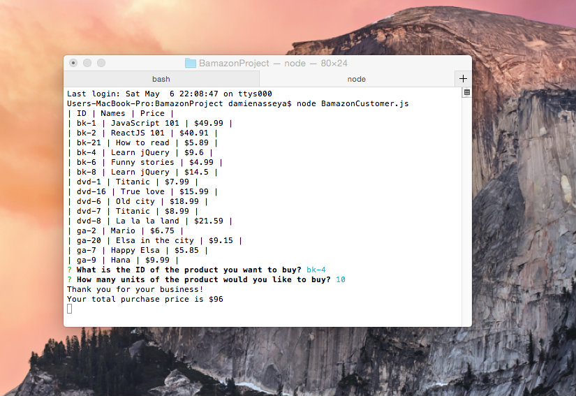

# BamazonProject

To run this application, follow these steps.
In your terminal, type:
```bash
node BamazonCustomer.js
```
First, all the items available for sale (include the *ids*, *names*, and *prices* of products) will appear in your terminal.

The app will prompt users with *two messages*.

The first asks users the ID of the product they would like to buy.

The second message asks how many units of the product they would like to buy.

Once the customer has placed the order, the application checks if the store has enough of the product to meet the customer's request.

If not, the app logs a phrase like `Insufficient quantity!`, and then prevent the order from going through.

Else, if the store does have enough of the product, the customer's order will be fulfilled.


